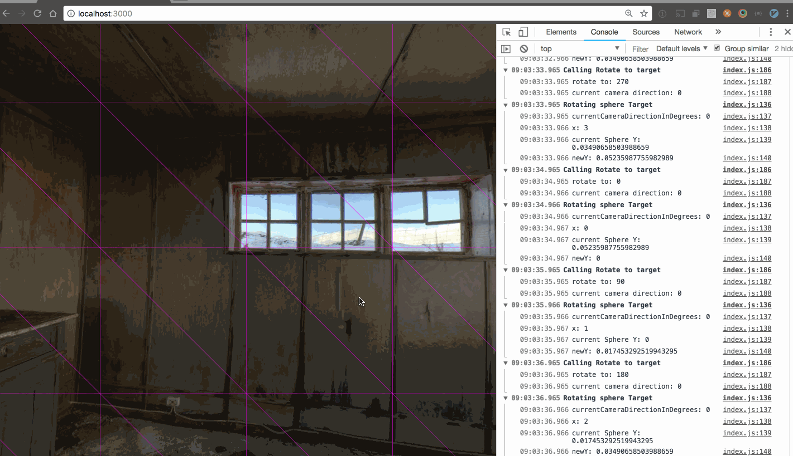

# Rotating a sphere in Three.js



I made this isolated proof of concept to try to understand exactly how rotating a sphere works in threejs.

I'm really rusty on geometry so it's been a learning/relearning process on multiple levels.

## Running the proof of concept

There's a simple express server set up to show the files. From the terminal, you can spin up the server by running:

```bash
npm run serve
```

There's not really anything that requires the express server, so you could alternatively point a simple web server to the `public` folder as the web root (e.g. VSCode's extension [Live Server](https://marketplace.visualstudio.com/items?itemName=ritwickdey.LiveServer)).

# To Do

- [x] Review the DeviceOrientationControll example's source code
- [x] Replicate it with a simple picture wrapped around the sphere
- [~] _Understand wtf is going on_
- [~] Rotate the sphere
